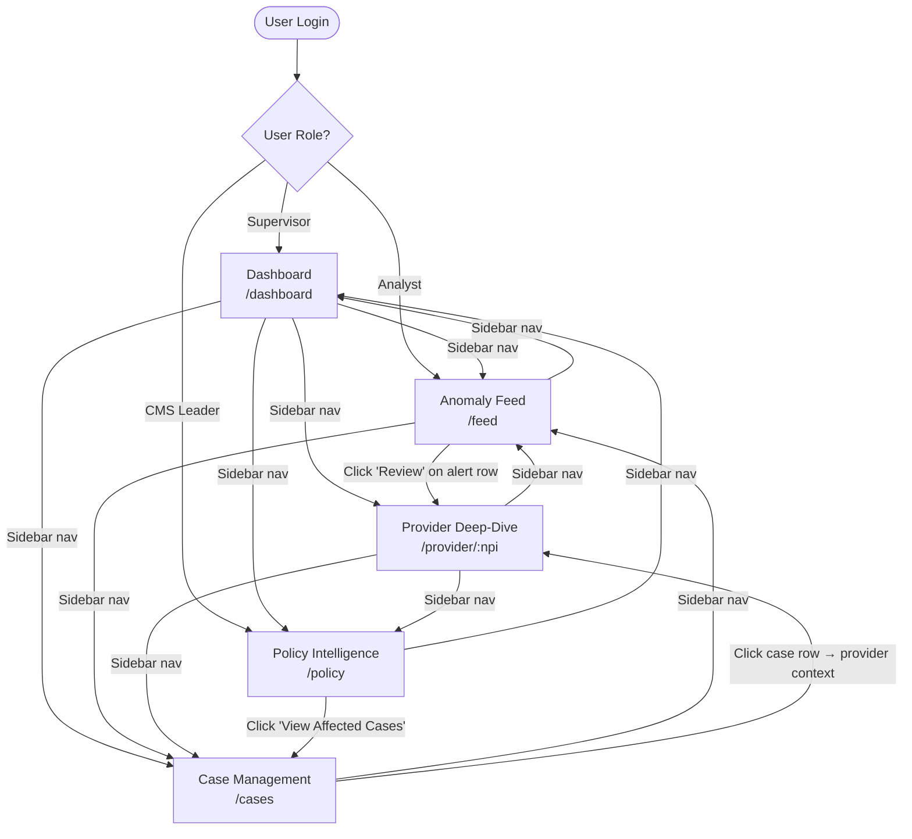
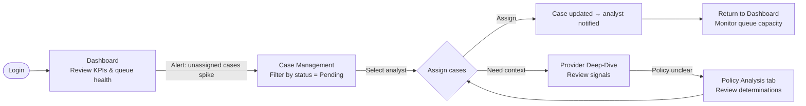
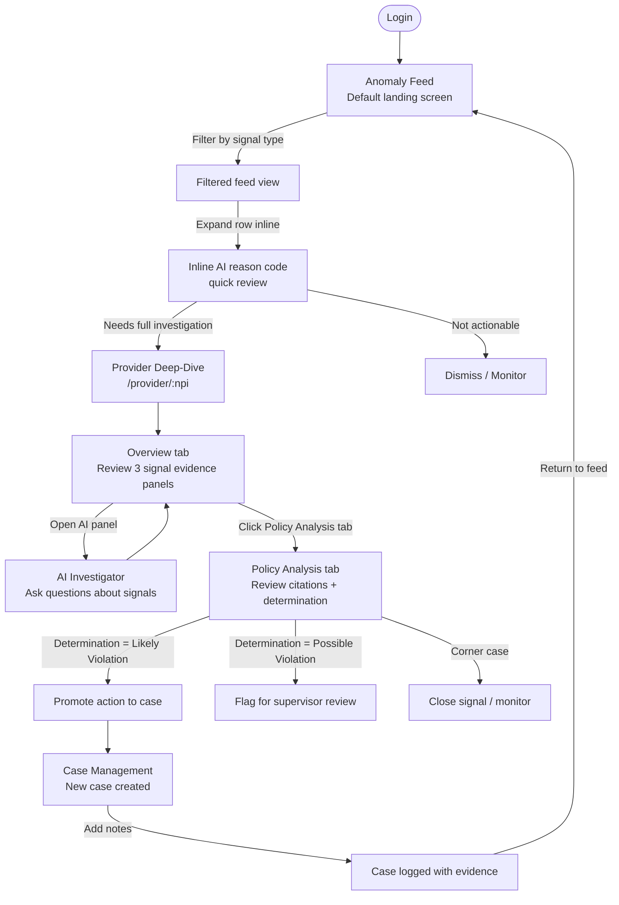
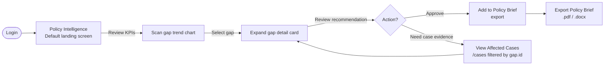

# Navigation Flow
**IntegrityAI · Program Integrity Accelerator**
`domain-pack/docs/navigation_flow.md`

---

## Overview

This document defines the complete navigation architecture of the IntegrityAI UI — screen-to-screen flows, role-based access rules, external system entry points, deep-link routing conventions, and overlay/panel states. It serves as the authoritative reference for both development and domain pack configuration.

### Navigation Philosophy

The UI is a **workflow-forward single-page application**: every navigation decision is grounded in the investigative workflow, not arbitrary information architecture. The three primary user journeys are:

1. **Supervisor Journey** — Monitor program health, review queue, escalate cases
2. **Analyst Journey** — Triage anomaly feed, investigate a provider, log findings to a case
3. **CMS Leadership Journey** — Review program-level policy gaps and approve policy briefs

All three journeys share the same shell (sidebar nav, top bar, AI panel), but each role's entry screen and default view differ. See [Role-Based Access](#role-based-access) below.

---

## Screen Inventory

| Screen ID | Route | Label | Primary Role(s) |
|-----------|-------|-------|-----------------|
| `dashboard` | `/dashboard` | Dashboard | Supervisor, Analyst |
| `feed` | `/feed` | Anomaly Feed | Analyst, Supervisor |
| `provider` | `/provider/:npi` | Provider Deep-Dive | Analyst |
| `cases` | `/cases` | Case Management | Analyst, Supervisor |
| `policy` | `/policy` | Policy Intelligence | CMS Leader, Supervisor |
| `[ai-panel]` | Overlay (all routes) | AI Investigator | Analyst, Supervisor |

---

## Primary Navigation Flow

The main screen-to-screen flow accessible via the persistent left sidebar.



---

## Detailed Journey Flows

### Journey 1 — Supervisor: Daily Queue Review



**Key decision points:**
- Dashboard `Queue Health` capacity bar turns red (≥80%) → trigger: navigate to Case Management to reassign
- Provider risk score ≥90 + status `Pending` → trigger: supervisor escalates manually to `Escalated`

---

### Journey 2 — Analyst: Investigate and Case an Alert



**Key decision points:**
- Signal `riskScore < 75` AND `confidenceLevel < 0.75` → analyst may dismiss without full deep-dive
- Policy determination `verdict = likely_violation` AND `confidence ≥ 0.85` → direct promotion to case
- Policy determination `verdict = possible_violation` → route to supervisor for escalation decision

---

### Journey 3 — CMS Leader: Policy Brief Review



---

## Role-Based Access

### Role Definitions

| Role ID | Label | Description |
|---------|-------|-------------|
| `analyst` | Program Integrity Analyst | Front-line investigator. Triages feed, investigates providers, creates cases. |
| `supervisor` | Supervisory Analyst / Manager | Reviews queue health, assigns cases, escalates, approves actions. |
| `cms_leader` | CMS Program Leadership | Reviews systemic policy gaps, approves policy change recommendations. |

> **Domain Pack Note:** Map these core roles to your program's organizational role taxonomy in the domain pack configuration. For example, a Medicaid pack may have `state_pi_analyst`, `state_program_director`, and `cms_cmcs_liaison` roles that map to `analyst`, `supervisor`, and `cms_leader` respectively.

---

### Screen Access Matrix

| Screen | `analyst` | `supervisor` | `cms_leader` |
|--------|-----------|--------------|--------------|
| Dashboard | ✅ Read | ✅ Read + Queue management | ✅ Read-only |
| Anomaly Feed | ✅ Full access | ✅ Full access | 🚫 Hidden |
| Provider Deep-Dive — Overview | ✅ Full access | ✅ Full access | 🚫 Hidden |
| Provider Deep-Dive — Policy Analysis | ✅ Read + promote actions | ✅ Read + approve escalations | 🚫 Hidden |
| Provider Deep-Dive — Evidence Log | ✅ Read + add notes | ✅ Read + add notes | 🚫 Hidden |
| Provider Deep-Dive — Billing Timeline | ✅ Read | ✅ Read | 🚫 Hidden |
| Case Management | ✅ Own cases | ✅ All cases + assign | 🚫 Hidden |
| Policy Intelligence | 🚫 Hidden | ✅ Read-only | ✅ Full access + export |
| AI Investigator Panel | ✅ Full access | ✅ Full access | ✅ Read-only context |

---

### Default Landing Screen by Role

| Role | Default Screen | Rationale |
|------|---------------|-----------|
| `analyst` | Anomaly Feed (`/feed`) | Primary work surface — triage starts here |
| `supervisor` | Dashboard (`/dashboard`) | Queue health and KPIs are the supervisor's first concern |
| `cms_leader` | Policy Intelligence (`/policy`) | Systemic view is the only relevant screen |

---

### Permission-Gated UI Elements

These specific UI controls are hidden or disabled based on role, even when a screen is accessible:

| UI Element | Condition | Behavior |
|------------|-----------|----------|
| Case assignment dropdown | `role = analyst` | Shows own name only; cannot assign to others |
| Case assignment dropdown | `role = supervisor` | Shows all active investigators |
| "Add to Policy Brief" button | `role ≠ cms_leader` | Hidden |
| "Export Policy Brief" button | `role ≠ cms_leader` | Hidden |
| Case status → `Escalated` | `role = analyst` | Disabled; analyst can request escalation, supervisor confirms |
| Provider Deep-Dive — Policy Analysis "Approve Escalation" | `role ≠ supervisor` | Hidden |
| Dashboard — Queue Health analyst capacity bars | `role = analyst` | Shows own row only |

---

## External System Entry Points

These are the inbound navigation paths from systems outside the IntegrityAI UI — e.g., email notifications, claims processing systems, or external dashboards.

### Entry Point 1 — Alert Notification Email → Provider Deep-Dive

**Trigger:** System generates an email or notification when a new high-risk signal is detected.
**Inbound URL:** `/provider/:npi?signal=:signalId&tab=overview`
**Behavior:**
- Navigates directly to Provider Deep-Dive for the specified NPI
- Activates the Overview tab
- Highlights the signal card matching `:signalId` (scroll into view, pulse animation)
- AI panel auto-opens with pre-loaded analysis for the signal

**Domain Pack Note:** Configure the notification trigger `riskScore` threshold. Default: notify on `riskScore ≥ 90`. Adjust per program's alert volume tolerance.

---

### Entry Point 2 — Claims Processing System → Anomaly Feed (Filtered)

**Trigger:** Claims adjudication system flags a claim and passes the provider NPI or claim ID to IntegrityAI.
**Inbound URL:** `/feed?providerNpi=:npi` or `/feed?claimId=:claimId`
**Behavior:**
- Opens the Anomaly Feed pre-filtered to the specified provider or claim
- Filter chip displays the NPI or claim ID as an active filter
- If only one result matches, auto-expands the inline AI reason code

---

### Entry Point 3 — Case Referral Email → Case Management

**Trigger:** A supervisor assigns a case to an analyst; analyst receives an email with a direct link.
**Inbound URL:** `/cases?caseId=:caseId`
**Behavior:**
- Opens Case Management with the specified case highlighted and scrolled into view
- Case row is in expanded state showing case details
- Quick navigation link to the associated provider deep-dive is surfaced inline

---

### Entry Point 4 — Policy Brief Export Link → Policy Intelligence

**Trigger:** A CMS leadership stakeholder receives a shared policy brief link.
**Inbound URL:** `/policy?gapId=:gapId`
**Behavior:**
- Opens Policy Intelligence with the specified gap's detail card expanded
- All other gap cards are collapsed
- Export button is prominently surfaced

**Domain Pack Note:** Policy brief links may require elevated authentication. Configure session handling for external leadership link access.

---

## Deep-Link & URL Routing Conventions

### Route Schema

```
/[screen]/[optional-resource-id]?[query-params]
```

### Defined Routes

| Route | Screen | Path Params | Query Params | Notes |
|-------|--------|-------------|--------------|-------|
| `/dashboard` | Dashboard | — | `?program=[id]` | Overrides program switcher on load |
| `/feed` | Anomaly Feed | — | `?type=[signal_type]` `?npi=[npi]` `?claimId=[id]` | Applies filter on load |
| `/provider/:npi` | Provider Deep-Dive | `npi` | `?signal=[signalId]` `?tab=[tab_id]` `?program=[id]` | `:npi` is the 10-digit NPI |
| `/cases` | Case Management | — | `?caseId=[id]` `?status=[status]` `?analyst=[analyst_id]` | `caseId` expands the matched row |
| `/policy` | Policy Intelligence | — | `?gapId=[id]` `?program=[id]` | `gapId` expands the matched gap card |

### Tab IDs for Provider Deep-Dive

| `?tab=` value | Opens |
|---------------|-------|
| `overview` | Overview tab (default) |
| `policy` | Policy Analysis tab |
| `evidence` | Evidence Log tab |
| `timeline` | Billing Timeline tab |

### Program Switcher via Query Param

Appending `?program=medicare` or `?program=medicaid` to any route will activate that program context on load, overriding the user's last-used program. Used by external notification systems to link directly into the correct program context.

---

## Overlay & Panel States

These states layer on top of screen content without changing the route.

### AI Investigator Panel

| State | Trigger | Behavior |
|-------|---------|----------|
| **Closed** (default) | — | Panel hidden. Sidebar toggle button shows inactive state. |
| **Open** | Click "AI Investigator" in sidebar | Panel slides in from right (420px wide). Main content area gains `margin-right: 420px`. Transition: `cubic-bezier(.16,1,.3,1) 0.4s`. |
| **Pre-loaded context** | Navigate to Provider Deep-Dive while panel is open | Panel content updates to reflect the current provider. Pre-loads AI analysis for the provider's top signal. |
| **Auto-open** | Inbound deep-link with `?signal=` param | Panel opens automatically with analysis pre-loaded for the specified signal. |

**Domain Pack Note:** The AI panel's pre-loaded prompt template is configurable per domain pack. Configure the system prompt to reference program-specific terminology and policy corpus.

---

### Anomaly Feed — Inline Reason Code Expansion

| State | Trigger | Behavior |
|-------|---------|----------|
| **Collapsed** (default) | — | Row shows provider name, signal type, risk score, confidence, at-risk amount, action button. |
| **Expanded** | Click anywhere on the row body | Row expands below to reveal AI inline reason code panel. Only one row expanded at a time (exclusive toggle). |
| **Collapsed** | Click expanded row again | Row collapses. Smooth height transition. |

---

### Policy Gap Detail Cards (Policy Intelligence)

| State | Trigger | Behavior |
|-------|---------|----------|
| **Collapsed** (default) | — | Row shows gap title, source, severity badge, scope, exposure, program impact, chevron. |
| **Expanded** | Click gap row | Expands below to reveal description, stats, recommendation, and action buttons. Only one card expanded at a time. |
| **Deep-linked open** | Inbound `?gapId=` param | The matching card is expanded on load; all others remain collapsed. |

---

## Program Switcher Behavior

The program switcher in the sidebar allows toggling between Medicare FFS and Medicaid FFS (or any configured programs).

| Event | Behavior |
|-------|----------|
| Switch program | All screen data re-fetches for the new program context. KPIs, feed, cases, and policy gaps all update. |
| Switch program on Provider Deep-Dive | If the current provider exists in the new program, data updates. If not, user is redirected to the feed for the new program. |
| Switch program on Policy Intelligence | Policy gap list re-filters to the selected program (`gap.programImpact` filter applied). |
| Deep-link with `?program=` | Program switcher initializes to the specified program, overriding the user's last session state. |

**Domain Pack Note:** To add a new program to the switcher, register it in the `programs` configuration object with `id`, `label`, and `color`. The switcher renders dynamically from this config — no UI code changes required.

---

## Navigation Anti-Patterns to Avoid

The following navigation behaviors are explicitly **not supported** and should not be introduced in domain pack extensions:

- **Full page reloads** on program switch — all transitions must be client-side state updates
- **Nested routing within Provider Deep-Dive tabs** — tabs are UI state only, not sub-routes (tabs do not update the URL)
- **Back-button dependency** — the UI should not assume browser history. All context needed to render a screen must be in the URL or session state
- **Role-gated screens with broken routes** — a `cms_leader` navigating to `/feed` directly should be gracefully redirected to `/policy`, not shown an error
