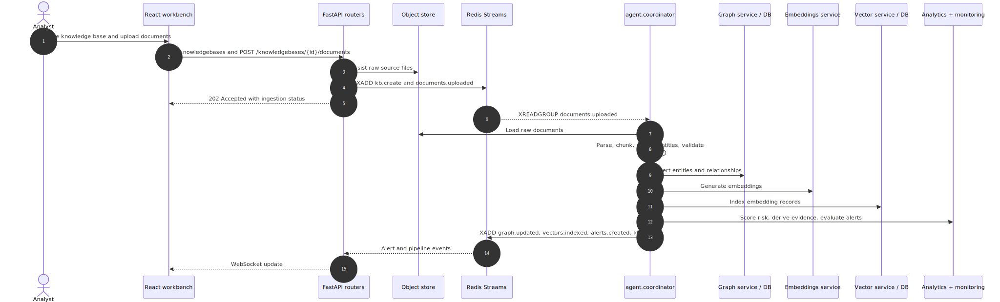
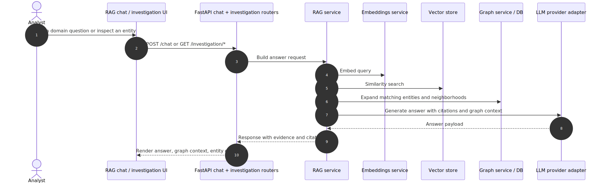

# chiliAI Detailed System Architecture Diagram

This diagram captures the current runtime shape of chiliAI: a React analyst workbench, a FastAPI gateway, Redis Streams for asynchronous orchestration, a Python worker pipeline, and adapter-backed graph, vector, object-storage, LLM, and embedding integrations.

Rendered SVG output is available at `docs/rendered/system_architecture_diagram_rendered.md`.

## Primary Request Paths

## Deployment Mapping

| Layer | Local development | Production / cluster path |
| --- | --- | --- |
| Frontend | `chili_app` Vite dev server on `:5173` | `chili-app` nginx container behind Ingress |
| API | `uvicorn api.app:create_app --reload` on `:8000` | `chili-api` Deployment + Service + optional HPA |
| Worker | `python -m agent.coordinator` | `chili-worker` Deployment + Service + optional HPA |
| Events | Redis Compose service | Redis StatefulSet or managed Redis |
| Graph | Neo4j Compose service in dev config | External Neo4j, Memgraph, or Neptune |
| Vector | In-memory by default; Qdrant container available | External Qdrant, pgvector, or Weaviate |
| Object storage | Local filesystem volume | S3, MinIO, or local filesystem volume |
| Secrets | `.env` and environment variables | Kubernetes Secret referenced by workloads |

## Architectural Notes

- The API is the synchronous gateway for frontend-driven workflows; it should validate requests, wire dependencies, publish events, and delegate business behavior to capability services.
- Redis Streams decouple interactive requests from longer-running ingestion, graph, embedding, analytics, and alerting work. Workers consume with consumer groups and publish downstream events.
- Adapter protocols isolate vendor-specific graph, vector, LLM, embedding, and object-store code from business logic.
- `DomainConfig` is the main reconfiguration surface. It controls entity and relationship definitions, enabled capabilities, thresholds, and adapter selections.
- `shared` is the leaf contract package. Backend modules should exchange stable shared types instead of importing each other's internals.
